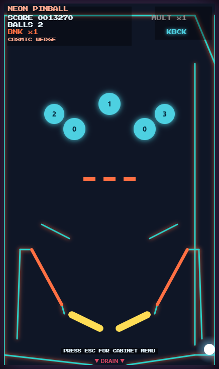

# NEON PINBALL

Arcade-style browser pinball with a neon cabinet look, theme packs, gameplay modes, light effects, and a pause/cabinet menu.

## Features

- 🎨 3 built-in theme packs:
  - Sunburst Classic
  - Cosmic Wedge
  - Volcano Pop
- 🧩 4 gameplay modes with unique table layouts/objectives:
  - Top Lanes
  - Drop Bank
  - Spell Neon
  - Bumper Frenzy
- 💡 Event-driven lighting effects (bumper/sling/drop/jackpot/drain/game over)
- 🔊 Theme-specific retro audio with sound toggle
- 🕹️ Cabinet menu overlay with theme + mode + sound controls
- 💾 Persistent settings (theme, mode, sound) via localStorage
- 🛟 Left and right kickback saves plus a mini left flipper for outlane recoveries
- 🎯 Score systems including combo multiplier growth and a one-time extra ball at 500,000 points
- 🧪 Playwright regression tests for physics, gameplay, and menu behavior

## Controls

- `Z` / `Left Arrow`: Left flipper
- `/` / `Right Arrow`: Right flipper
- `Space`: Plunger / launch
- `P`: Pause
- `Esc`: Open/close **Cabinet Menu**
- In Cabinet Menu:
  - `1` / `2` / `3`: Select theme
  - `4` / `5` / `6` / `7`: Select gameplay mode
  - `S`: Toggle sound
  - `Enter`: Apply + resume
  - `Esc`: Cancel + resume

## Run locally

Open `index.html` directly in your browser.

## TinyToolTown readiness

This repository is prepared for TinyToolTown publication:

- ✅ Single-file playable app (`index.html`)
- ✅ Keyboard controls documented
- ✅ Screenshot included for listing/preview (`image.png`)
- ✅ Automated test coverage via Playwright
- ✅ MIT license included for open redistribution

## Run tests

Install dependencies (if needed), then run Playwright:

- `npm install`
- `npx playwright test launch.spec.js`

## Project structure

- `index.html` — Game + rendering + input + cabinet menu + modes/themes/audio/settings
- `launch.spec.js` — Playwright gameplay and regression tests
- `docs/superpowers/` — design/spec/planning docs

## License

This project is licensed under the **MIT License**.

See [`LICENSE`](./LICENSE) for full text.
